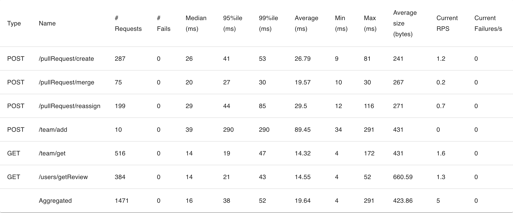
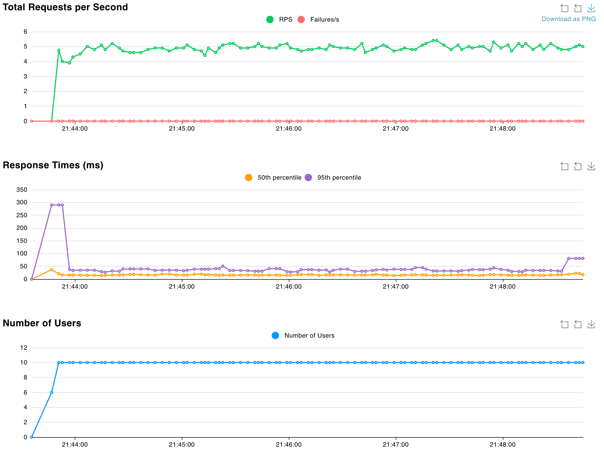

# Результаты нагрузочного тестирования

**Фреймворк**: locust

**Настройки для запуска:**
```zsh
locust -f locustfile.py
```
**Хост в браузере:**
`http://localhost:8089`

#### Запуск:
- Number of users (peak concurrency): 10 
- Spawn rate (users started/second): 2
- Host: `http://localhost:8080`
- Time: 5m

10users/2s = 5 RPS


### Результаты:
---




1. Aggregated RPS = 5 (оптимально, соответствует требуемым 5 RPS)
2. Время ответа (Latency): aggregated 95%ile = 38ms, average = 19.64ms, при этом больше всего времени занимает `/team/add` (290ms)*. Latency соoответсвует SLI < 300ms.
3. Успешность (Success Rate): #Fails = 0, что удовлетворяет SLI > 99.9%




---

**Заключение**: Система выдерживает целевую нагрузку.


---

* Исходя из базового предположения (см. описание), что этот эндпоинт меняет состояние команды (в том числе переписывает участников команды). Если же все гораздо проще, то измение бизнес-логики POST `/team/add` приведет к снижению времени ожидания примерно в в 7-8 раз.